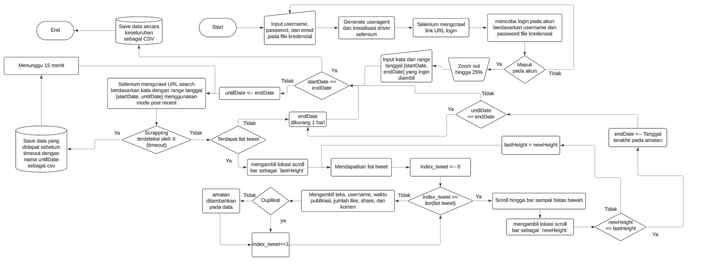

# X (formerly Twitter) Post Scraper

A Python-based scraper to extract posts from X (formerly Twitter) based on specific search criteria, using Selenium with an undetected ChromeDriver for web automation.

Originally built for personal research (e.g., #Terimakasihjokowi during Prabowo's inauguration in late 2024). If ur interested in collaborating or have questions, feel free to reach out!

Note: X's interface and policies may change, potentially affecting the scraper's functionality.

## Features
- Filtered search with full query composition (keywords, accounts, hashtags, min counts, replies/links) (see [X Advanced Search](https://x.com/search-advanced))
- Date-range crawling with automatic day stepback when no posts are found
- Duplicate protection across resumed sessions
- Auto-save and resume from savepoints
- CSV and JSON export options

## Example Output
Example data can be seen in [Process/jokowi_twitterACC](Process/jokowi_twitterACC) and [Process/MBG](Process/MBG). Legacy code data can be seen in [Legacy/terimaKasihJokowi.csv](Legacy/terimaKasihJokowi.csv).

### Sample Output from "Makan Bergizi Gratis" Search
| User | Date | post_text | quotedPost_text | Reply_count | Repost_count | Like_count | View_count |
| --- | --- | --- | --- | --- | --- | --- | --- |
| @PolitisiTidurr | 2026-01-15-19:30:18 | Ini bukan lagi program "Makan Bergizi Gratis" (MBG), tapi "Malapetaka Beracun Gratis". Angka 21.254 korban bukan sekadar statistik, itu adalah nyawa anak-anak yang dijadikan kelinci percobaan kebijakan populis yang dipaksakan tanpa kesiapan sanitasi dan pengawasan logistik. |  | 0 | 0 | 0 | 86 |
| @diydiydi | 2026-01-15-20:15:26 | Anak kicikku dapat makan berGIZI gratisTapi slalu ada produk ultra proses food entah itu satu atau bahkan makanan utamanya, alhasil mubazir Aturannya kan gaboleh makek upf 😭 |  | 0 | 0 | 0 | 6 |
| @venusdocxx | 2026-01-15-18:55:38 | Wapres Gibran tinjau langsung ke Wamena Papua pastikan program makan bergizi gratis berjalan optimal di daerah terpencil wujud komitmen dan Kerja Nyata untuk anak bangsa #LanjutkanMBG#LanjutkanMBG Apink JAEMIN FOR LEE JEANS #IamPOLCASAN_MV#IamPOLCASAN_MV PERTHSANTA PRESENTER DRPONG |  | 0 | 0 | 0 | 198 |

## Requirements
- Python 3.9+
- Google Chrome installed, preferably version 144.

## Setup
1. Clone the repository:

    ```bash
    git clone
    ```

2. Edit credentials at [Credentials/twitter.json](Credentials/twitter.json) with the format:

	```json
	{
	  "username": "your_username",
	  "password": "your_password",
	  "email": "your_email"
	}
	```

3. Install dependencies:

	```bash
    pip install -r requirements.txt
	```

## Usage
The main notebook is [Notebook.IPYNB](Notebook.IPYNB). It contains:
- The `twitterScrapper` class (imported from [src.py](src.py))
- Examples of filter configuration
- Example `session.start(...)` calls

Quick flow:
1. Open the notebook
2. Update filters
3. Run the scraping cell

### Filter Options
Refer to [X Advanced Search](https://x.com/search-advanced) for filter explanations. Example filter configuration:

```python
FILTERS = {
    # Basic filters
    "all_these_words": "",           # Example: what’s happening · contains both “what’s” and “happening”
    "this_exact_phrase": "",         # Example: what’s happening · contains the exact phrase “what’s happening”
    "any_of_these_words": "'",       # Example: what’s happening · contains either “what’s” or “happening”
    "none_of_these_words": "",       # Example: what’s happening · does not contain the words “what’s” or “happening”
    "these_hashtags": "",            # Example: #whatshappening · contains the hashtag #whatshappening
    
    # Account filters
    "from_accounts": "",          # Example: from:Twitter · Tweets sent from the account Twitter
    "to_accounts": "",            # Example: to:Twitter · Tweets sent in reply to the account Twitter
    "mentioning_accounts": "",    # Example: @Twitter · Tweets that mention the account Twitter

    # Additional filters
    "Minimum_replies": "",         # Example: min_replies:100 · Tweets with at least 100 replies
    "Minimum_likes": "",           # Example: min_faves:100 · Tweets with at least 100 likes
    "Minimum_retweets": "",        # Example: min_retweets:100 · Tweets with at least 100 retweets
    "links": True,                 # Example: filter:links · Include posts with links | If disabled, only posts without links
    "replies": True,               # Example: filter:replies · Include replies and original posts | If disabled, only original posts
}
```

On "any_of_these_words", normally it would seperate string with spaces. However, if you don't want the string to be seperated, you can put `\'` in the start and end of the string. E.g, `"any_of_these_words": "\'Makan Bergizi Gratis\' \'MBG\'"` would search for posts that contains either "Makan Bergizi Gratis" or "MBG".

## Output
By default, outputs are stored in:
- [Process](Process) for current runs
- Savepoints under the selected process directory
- Final CSV/JSON on completion

## Project Structure
- [src.py](src.py): main implementation
- [Notebook.IPYNB](Notebook.IPYNB): main notebook for running the scraper
- [requirements.txt](requirements.txt): dependencies
- [Credentials](Credentials): Credentials storage
- [Process](Process): runtime outputs and savepoints
- [LEGACY](LEGACY): old versions (deprecated)

## Pipeline of the LEGACY code (Deprecated)


## Notes
- X may trigger “suspicious login attempt” and require email verification.
- If scraping detection occurs, the scraper can auto-save and wait before continuing.

## Disclaimer
This tool is intended for educational and research purposes only. Ensure compliance with X’s terms of service and privacy policies when using this scraper. The author is not responsible for any misuse of this tool.